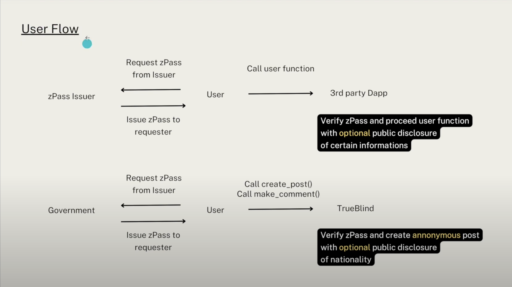
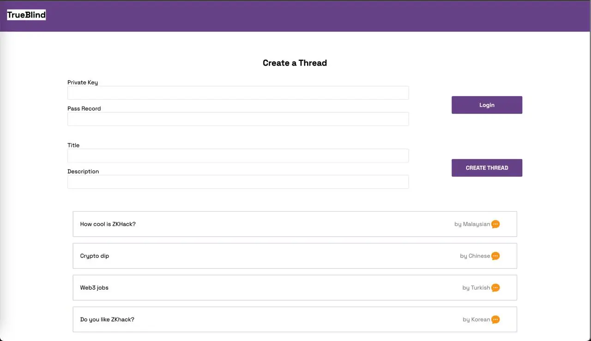
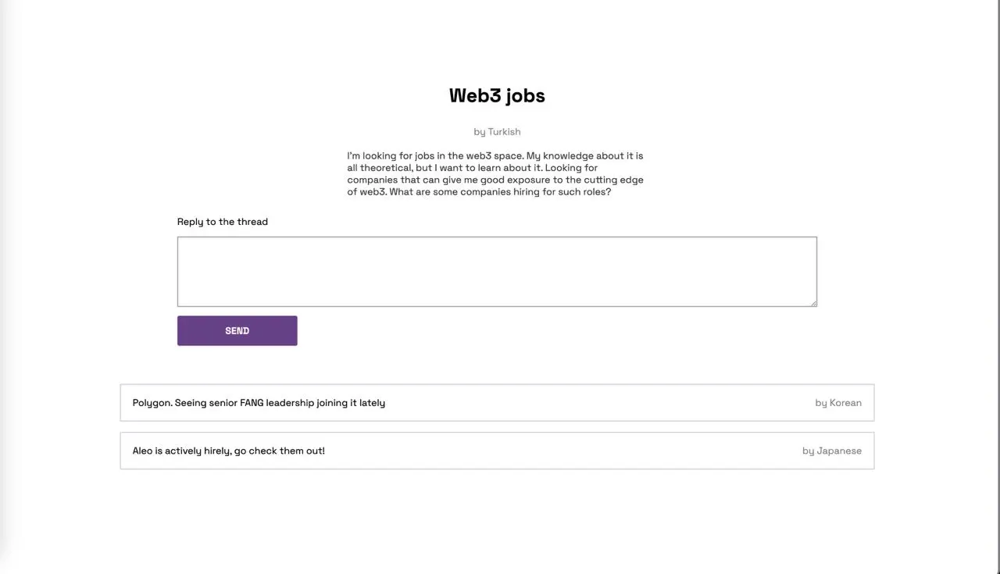
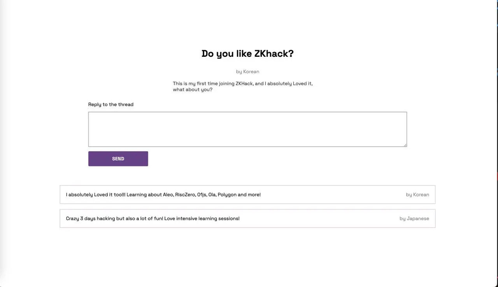

# True Blind

<b><u>Winner of 2023 Devconnect ZK Hack Aleo Track</u></b>
- Project Submission Link: https://devfolio.co/projects/trueblind-d3ad
- Project Demo Link: https://www.youtube.com/watch?v=RNbgUYqctZA

## Introduction

Introducing True Blind, inspired by https://www.teamblind.com/, a True Anonymous Forum platform built on top of Aleo Stack.

## The problem TrueBlind solves

Freedom of speech is a part of freedom of expression. Individuals should have the right to express themselves in whatever way they wish.
The problem we have in socials is speech does not have true freedom, either platform censorships or afraid of getting attacked by public when they talk of something sensitive to certain parties.
With TrueBlind, everyone is able host discussion anonymously, TRUELY.

## Architecture Diagram

## Product Screenshots

## Challenges we ran into

Not much examples to refer and build on Aleo. Challenge like arrays is static and hard to apply in our usecase. And we only had 6 hours to hack because of work schedule.